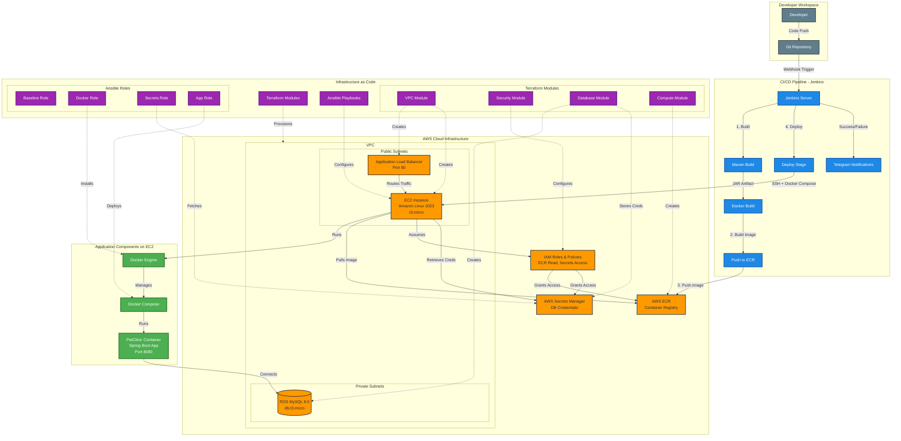
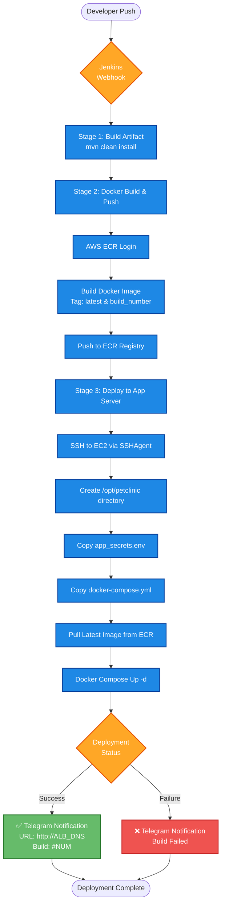
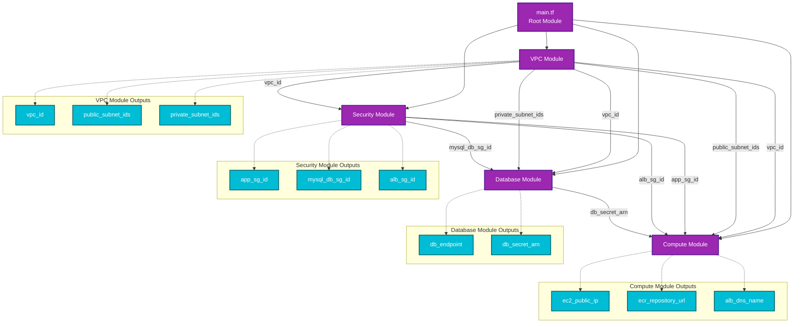
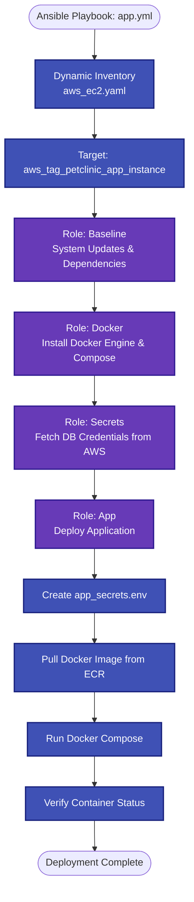
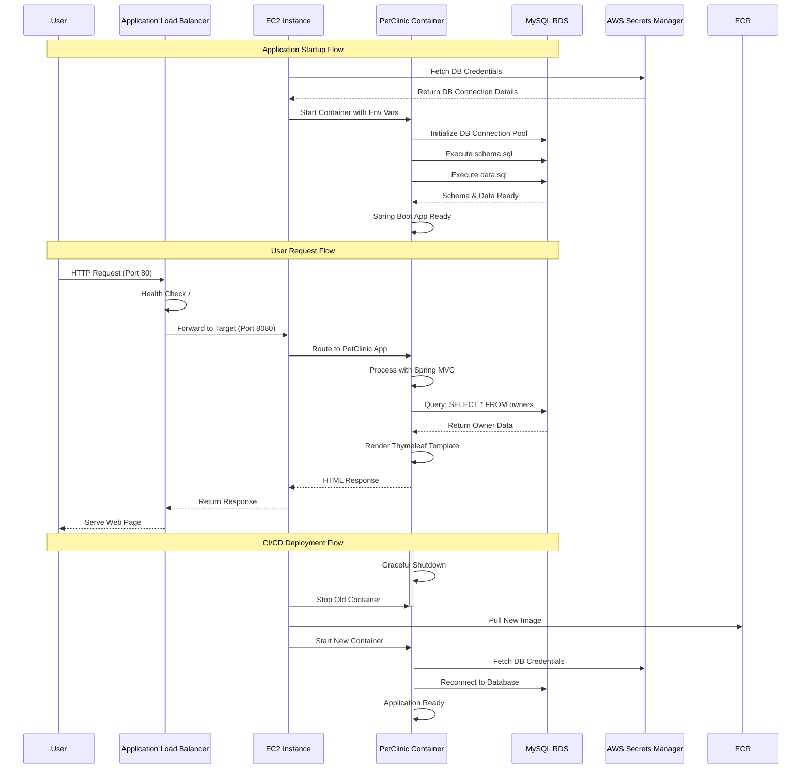
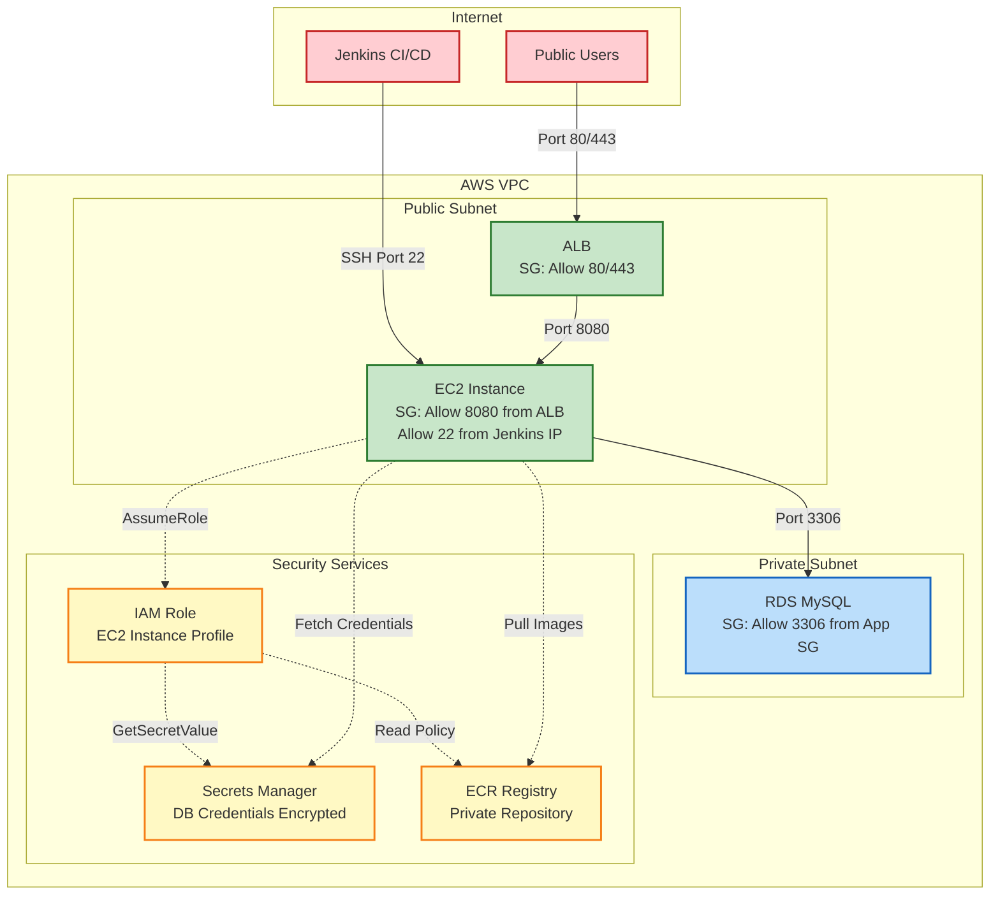

# PetClinic Project - Architecture Diagram

## System Architecture Overview

## Detailed Component Architecture

```mermaid
graph LR
    subgraph "Application Layer"
        USER[End User]
        BROWSER[Web Browser]
    end

    subgraph "AWS Network Layer"
        IGW[Internet Gateway]
        ALB[Application Load<br/>Balancer]
        TG[Target Group<br/>Port 8080]
    end

    subgraph "Compute Layer"
        EC2_INSTANCE[EC2 Instance]
        CONTAINER[PetClinic Container<br/>eclipse-temurin:17-jre-alpine<br/>Spring Boot + Thymeleaf]
    end

    subgraph "Data Layer"
        MYSQL[(MySQL 8.0 RDS<br/>petclinic DB)]
        SCHEMA[Schema: owners, pets,<br/>vets, visits, specialties]
    end

    subgraph "Security & Secrets"
        SG_ALB[Security Group: ALB<br/>Inbound: 80]
        SG_APP[Security Group: App<br/>Inbound: 8080, 22]
        SG_DB[Security Group: DB<br/>Inbound: 3306]
        SM[Secrets Manager<br/>DB Connection String]
    end

    USER -->|HTTPS/HTTP| BROWSER
    BROWSER -->|Port 80| IGW
    IGW --> ALB
    ALB -->|Health Check /| TG
    TG --> EC2_INSTANCE
    EC2_INSTANCE --> CONTAINER
    CONTAINER -->|JDBC Connection| MYSQL
    MYSQL --> SCHEMA

    SG_ALB -.->|Protects| ALB
    SG_APP -.->|Protects| EC2_INSTANCE
    SG_DB -.->|Protects| MYSQL
    CONTAINER -.->|Fetches| SM

    classDef userLayer fill:#B0BEC5,stroke:#546E7A,stroke-width:2px
    classDef networkLayer fill:#FF9900,stroke:#232F3E,stroke-width:2px
    classDef computeLayer fill:#4CAF50,stroke:#1B5E20,stroke-width:2px
    classDef dataLayer fill:#2196F3,stroke:#0D47A1,stroke-width:2px
    classDef securityLayer fill:#F44336,stroke:#B71C1C,stroke-width:2px

    class USER,BROWSER userLayer
    class IGW,ALB,TG networkLayer
    class EC2_INSTANCE,CONTAINER computeLayer
    class MYSQL,SCHEMA dataLayer
    class SG_ALB,SG_APP,SG_DB,SM securityLayer
```

## CI/CD Pipeline Flow

## Terraform Module Dependencies

## Ansible Deployment Workflow

## Data Flow Architecture

## Security Architecture

## Technology Stack Summary

### Infrastructure Layer
- **Cloud Provider**: AWS
- **IaC Tool**: Terraform (Modular Architecture)
- **Configuration Management**: Ansible
- **Compute**: EC2 t3.micro (Amazon Linux 2023)
- **Container Registry**: AWS ECR
- **Load Balancer**: Application Load Balancer (ALB)

### Database Layer
- **Database**: MySQL 8.0 on RDS (db.t3.micro)
- **Deployment**: Private subnet with DB subnet group
- **Security**: AWS Secrets Manager for credentials

### Application Layer
- **Framework**: Spring Boot 3.x
- **Language**: Java 17
- **Build Tool**: Maven
- **Template Engine**: Thymeleaf
- **Container**: Docker (eclipse-temurin:17-jre-alpine)
- **Orchestration**: Docker Compose

### CI/CD Layer
- **CI/CD Tool**: Jenkins
- **Build**: Maven
- **Containerization**: Docker
- **Deployment**: SSH + Docker Compose
- **Notifications**: Telegram Bot API

### Security Layer
- **Authentication**: IAM Roles & Instance Profiles
- **Secrets Management**: AWS Secrets Manager
- **Network Security**: VPC Security Groups
- **Access Control**: SSH Key-based authentication

### Monitoring & Logging
- **CloudWatch**: EC2 and RDS monitoring
- **Health Checks**: ALB health check on root path (/)

