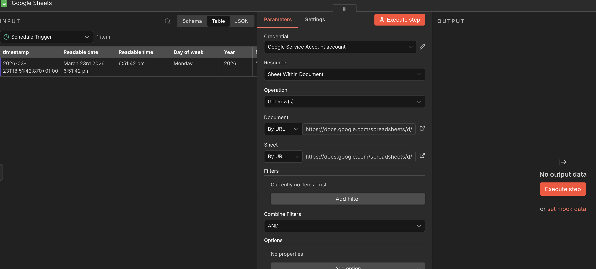
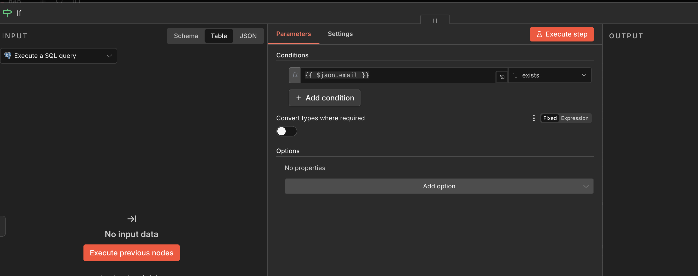
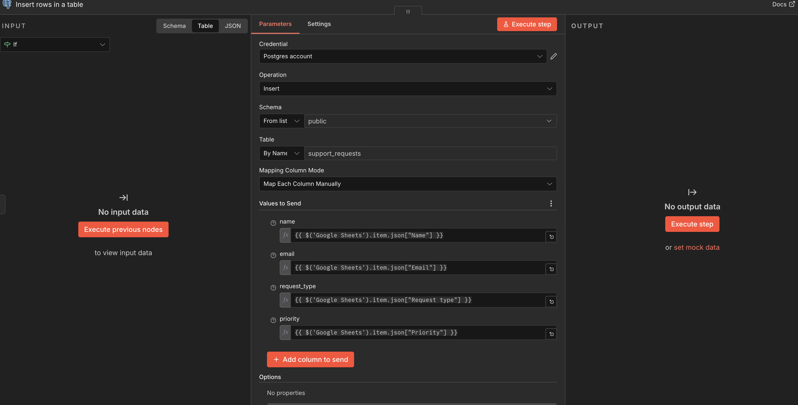
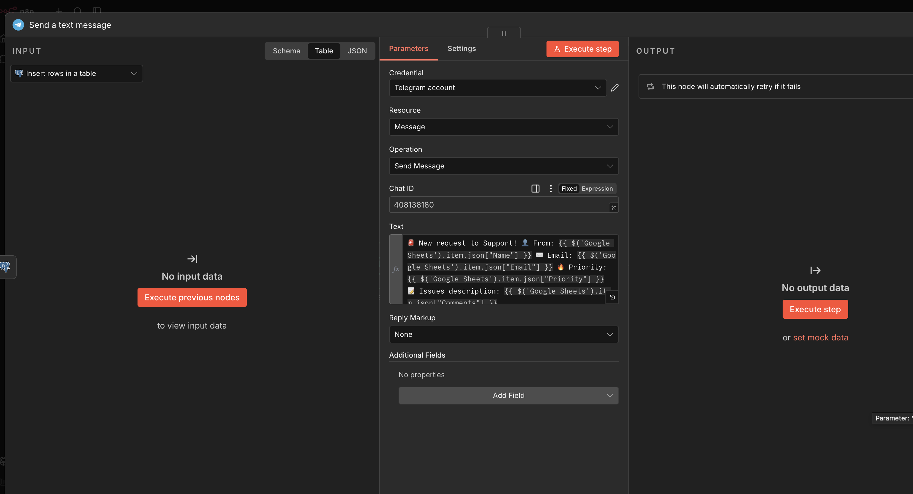
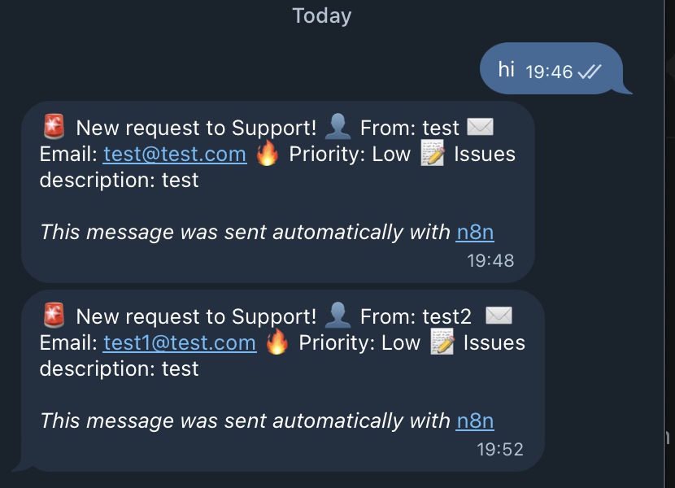

#### n8n Workflow for Support Request Management
1. Modify the docker-compose configuration to include a PostgreSQL database container and link it to the n8n service via environment variables.
2. Execute a one-time SQL query within n8n to create the primary database table required for storing the support requests.
3. Google Sheets Integration
4. Configure a schedule trigger to periodically read new responses from Google Sheets using a Google Cloud Service Account for secure authentication.
5. Implement a boolean SQL query and an IF exist node. 
6. Map the extracted data fields from Google Sheets and insert the new, unique support requests into the PostgreSQL database.
7. Send formatted alert messages to a designated Telegram group while utilizing a built-in retry mechanism to gracefully handle potential API failures.
